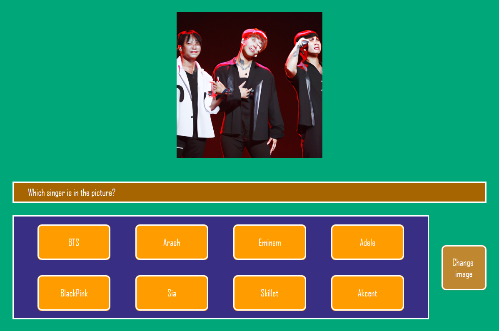
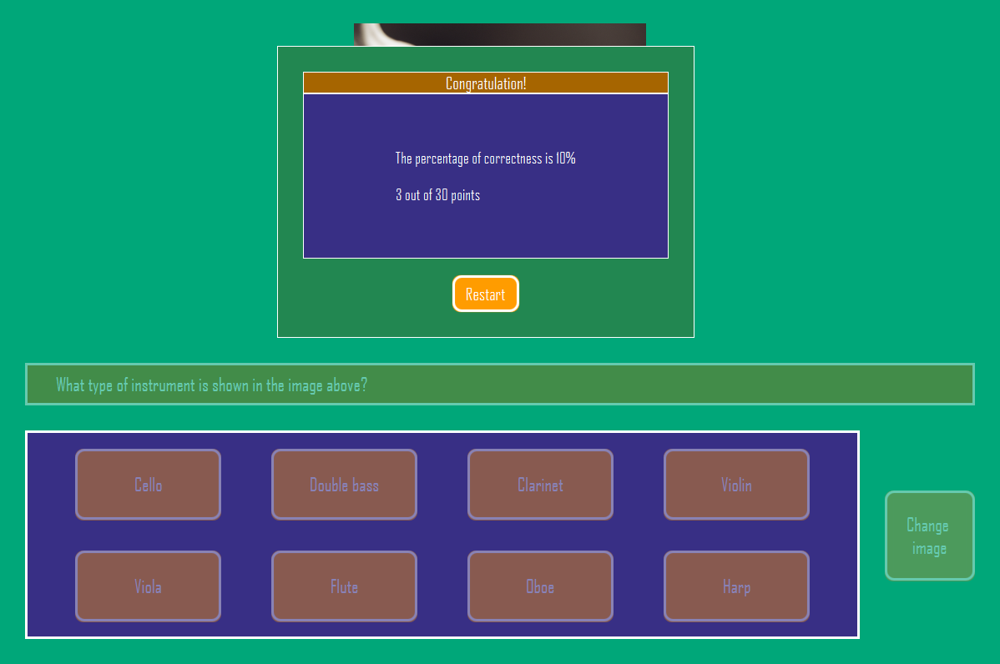

# Music quiz

## About

This project is a small quiz about music that was written in Java using Javafx. In it you can find 10 questions with 3 generated images that can be changed, and 8 possible answers
## Starting:

Clone the project repository or download the source code and install `java`, you can install java from :point_right:[here](https://www.oracle.com/java/technologies/downloads/). And after that run the project using your preferred Java development environment. Or you can install java and open the file `out/artifacts/Quiz_jar/Quiz.jar`

___

## Running

- After the launch, the quiz will start immediately. You can choose the answer or change image

- After passing, you will see the result of the quiz and a button to restart it

